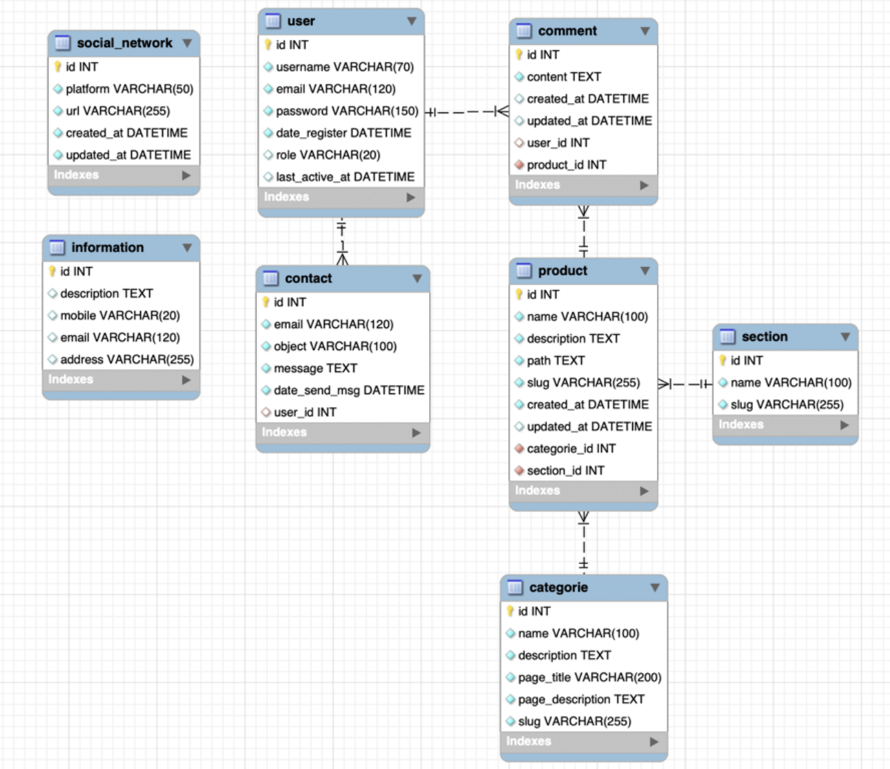
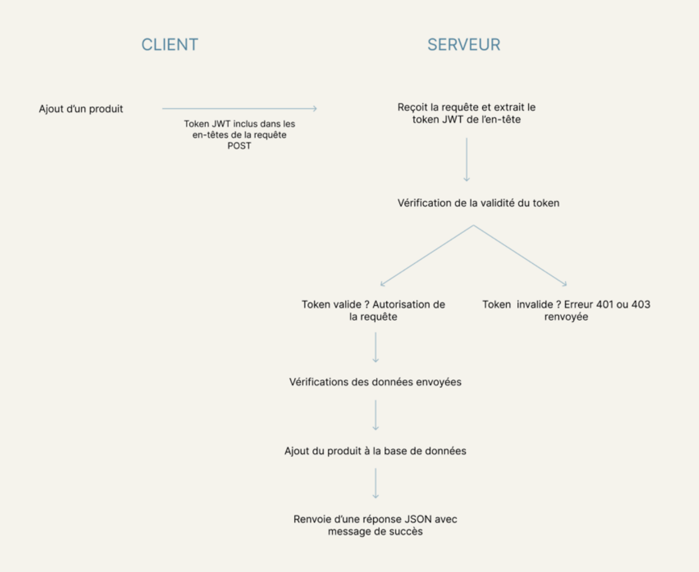

# Kaela Couture - Backend (PHP)

Backend PHP pour le site vitrine Kaela Couture. Il expose une API simple (routes via `router.php`) consommée par le front. Le projet fonctionne sous MAMP (macOS) et utilise MySQL, JWT, PHPMailer et Dotenv.

## Sommaire
- [Prérequis](#prérequis)
- [Démarrage rapide](#démarrage-rapide)
- [Architecture](#architecture)
- [Variables d’environnement (.env)](#variables-denvironnement-env)
- [Base de données](#base-de-données)
- [Authentification et rôles](#authentification-et-rôles)
- [Endpoints principaux](#endpoints-principaux)
- [Integration avec le front](#integration-avec-le-front)
- [Développement](#développement)
- [Déploiement](#déploiement)
- [Sécurité & notes](#sécurité--notes)
- [Utilisation sans macOS (Windows / Linux)](#utilisation-sans-macos-windows--linux)
  - [Windows (XAMPP ou WampServer)](#windows-xampp-ou-wampserver)
  - [Linux (LAMP)](#linux-lamp)
- [Annexes](#annexes)
  - [Schéma de base de données](#schéma-de-base-de-données)
  - [Flux du token JWT](#flux-du-token-jwt)

## Prérequis
- macOS (MAMP) ou Windows (XAMPP/WampServer) ou Linux (LAMP)
- PHP 8.1+ (recommandé 8.2), extensions: openssl, json, pdo_mysql, mbstring, gd (pour WebP)
- MySQL 8.x (ou MariaDB 10.5+)
- Composer 2.x
- (Optionnel) Docker + Docker Compose v2

## Démarrage rapide
1. Cloner le repo dans le dossier MAMP htdocs:
   ```bash
   cd /Applications/MAMP/htdocs
   git clone <votre-repo> kaela-back
   cd kaela-back
   ```
2. Installer les dépendances:
   ```bash
   composer install
   ```
3. Créer la base de données et importer le schéma:
   - Créez une base `kaela_couture`
   - Importez `kaela_couture.sql` via phpMyAdmin (MAMP) ou MySQL CLI
4. Créer le fichier `.env` à la racine:
   ```env
   # JWT
   JWT_SECRET_KEY=change_me_strong_secret

   # Email SMTP (utilisé par PHPMailer via Gmail SMTP)
   EMAIL=votre.email@gmail.com
   PASSWORD=mot_de_passe_ou_app_password
   ```
   - Note: Les identifiants DB sont codés dans `App/Database.php` (host/db/login/pw). En environnement MAMP par défaut: `root`/`root`.
5. Démarrer MAMP (Apache + MySQL). Placez le dossier en Document Root ou utilisez l’URL complète.
6. Tester l’API:
   - Point d’entrée: `index.php` (gère CORS, JSON, délègue à `router.php`).
   - Requête type:
     ```bash
     curl -X POST "http://localhost:8888/kaela-back/index.php?action=login" \
          -H "Content-Type: application/json" \
          -d '{"email":"user@example.com","password":"Secret123!"}'
     ```

## Architecture
- `index.php`: headers CORS/JSON + délégation vers `router.php`
- `router.php`: charge `.env`, routeurs domaine (products, categories, informations, social, sections) et actions publiques (signup, login, contact, commentaires)
- `App/`:
  - `Database.php`: connexion PDO (MySQL) pour `kaela_couture`
  - `Controllers/` et `Models/`: logique métier (CRUD, auth, contact, commentaires)
  - `Utils/`:
    - `AuthUtils.php`: extraction/validation JWT, contrôle d’accès par rôle
    - `Token.php`: génération JWT (HS256)
    - `ConvertToWebP.php`: conversion/resize/crop vers WebP (GD)
- `routes/`: fonctions `*Routes($adminAction, ...)` pour déléguer aux contrôleurs
- `assets/img/`: images WebP produits
- `lib/Slug.php`: utilitaire de slug
- `composer.json`: autoload PSR-4 et dépendances

## Variables d’environnement (.env)
- `JWT_SECRET_KEY`: clé secrète pour signer les JWT (HS256)
- `EMAIL`: email SMTP expéditeur/réception (Gmail)
- `PASSWORD`: mot de passe SMTP ou App Password Gmail

Chargement via `vlucas/phpdotenv` dans `router.php`.

## Base de données
- Fichier SQL: `kaela_couture.sql`
- `App/Database.php` utilise par défaut:
  - host: `localhost`
  - db: `kaela_couture`
  - user: `root`
  - password: `root`

Adaptez si vos identifiants MAMP diffèrent.

## Authentification et rôles
- Login (`action=login`): retourne `token` JWT (payload: `user_id`, `role`, `exp` 7j)
- Accès admin: endpoints d’admin vérifient `Authorization: Bearer <token>` via `AuthUtils::verifyAccess('admin')`

## Endpoints principaux
Base: `http://localhost:8888/kaela-back/index.php`

Actions publiques (paramètre `action`):
- `signup` (POST JSON): `{ username, email, password, consent }`
- `login` (POST JSON): `{ email, password }` → `{ success, token, role, user_id }`
- `contact` (POST JSON): `{ email?, object, message, userId? }` (si `userId` fourni, l’email est récupéré en DB)
- `getCommentsByProduct` (GET): `productDetailId=<id>`
- `addComment` (POST JSON): nécessite token (selon contrôleur), voir `App/Controllers/CommentsManagement/*`
- `updateComment` (PUT JSON): nécessite token (extrait `userId` via JWT)
- `deleteComment` (DELETE): nécessite token

Actions admin (paramètre `adminAction`, `Authorization: Bearer <token>` requis, rôle `admin`):
- Produits: `getProduct`, `getProductById`, `addProduct`, `updateProduct`, `deleteProduct`
- Catégories: `getProductCategory`, `getCategoryById`, `addCategory`, `updateCategory`, `deleteCategory`
- Informations: `getInformation`, `getInformationById`, `addInformation`, `updateInformation`, `deleteInformation`
- Réseaux sociaux: `getSocialNetwork`, `getSocialNetworkById`, `addSocialNetwork`, `updateSocialNetwork`, `deleteSocialNetwork`
- Sections: `getSection` (pas de vérification d’admin dans `sectionRoutes`)

Exemples:
```bash
# Liste produits (adminAction GET)
curl -X GET "http://localhost:8888/kaela-back/index.php?adminAction=getProduct"

# Ajout produit (adminAction POST, token requis)
curl -X POST "http://localhost:8888/kaela-back/index.php?adminAction=addProduct" \
  -H "Authorization: Bearer <JWT>" -H "Content-Type: application/json" \
  -d '{"name":"Robe","price":120,"category_id":1}'
```

## Integration avec le front
- Le backend expose JSON et autorise CORS pour toutes origines via `index.php`
- Le front doit appeler `index.php` avec `action` ou `adminAction` selon le cas
- Le token JWT doit être stocké côté front (ex: `localStorage`) et envoyé dans `Authorization`

## Développement
- Autoload via Composer (PSR-4). Si vous ajoutez des classes, exécutez:
  ```bash
  composer dump-autoload
  ```
- Tests: PHPUnit est présent en dev, à configurer si besoin

## Déploiement
- Assurez-vous de définir une `JWT_SECRET_KEY` robuste
- Configurez un SMTP fiable (Gmail App Password recommandé)
- Servez via Apache/Nginx en pointant sur `index.php`

## Sécurité & notes
- Ne pas commiter `.env`
- Valider/sanitizer toutes entrées (déjà appliqué dans les contrôleurs)
- Mettre à jour PHP et dépendances régulièrement

## Utilisation sans macOS (Windows / Linux)

### Windows (XAMPP ou WampServer)
1. Installer XAMPP ou WampServer
2. Cloner le projet dans le dossier web:
   - XAMPP: `C:\xampp\htdocs\kaela-back`
   - Wamp: `C:\wamp64\www\kaela-back`
3. Démarrer Apache + MySQL
4. Installer Composer (Windows) puis dans le dossier du projet:
   ```bash
   composer install
   ```
5. Base de données:
   - Créer la base `kaela_couture`
   - Importer `kaela_couture.sql` avec phpMyAdmin (`http://localhost/phpmyadmin`)
6. Variables d’environnement: créer `.env` à la racine (voir section `.env` plus haut)
7. Identifiants MySQL sous XAMPP/Wamp par défaut:
   - XAMPP: `user: root`, `password: ''` (vide)
   - Wamp: `user: root`, `password: ''` (vide)
   Le projet utilise `root:root` dans `App/Database.php`. Deux options:
   - Modifier `App/Database.php` pour refléter vos identifiants réels
   - Ou créer un utilisateur `root` avec mot de passe `root`
8. URL d’accès:
   - `http://localhost/kaela-back/index.php`

### Linux (LAMP)
1. Installer Apache, PHP, MySQL (ou MariaDB) et Composer
2. Placer le projet dans le DocumentRoot, ex. `/var/www/html/kaela-back`
3. Droits fichiers si nécessaire:
   ```bash
   sudo chown -R www-data:www-data /var/www/html/kaela-back
   ```
4. Installer les dépendances:
   ```bash
   cd /var/www/html/kaela-back && composer install
   ```
5. Créer la base `kaela_couture` et importer `kaela_couture.sql`
6. Créer `.env` (voir section `.env`)
7. Adapter `App/Database.php` à vos identifiants (souvent `root` sans mot de passe en local, sinon un utilisateur dédié)
8. Tester: `http://localhost/kaela-back/index.php`

---

## Licence
Projet privé Kaela Couture. Tous droits réservés.

---

## Annexes

### Schéma de base de données



### Flux du token JWT

